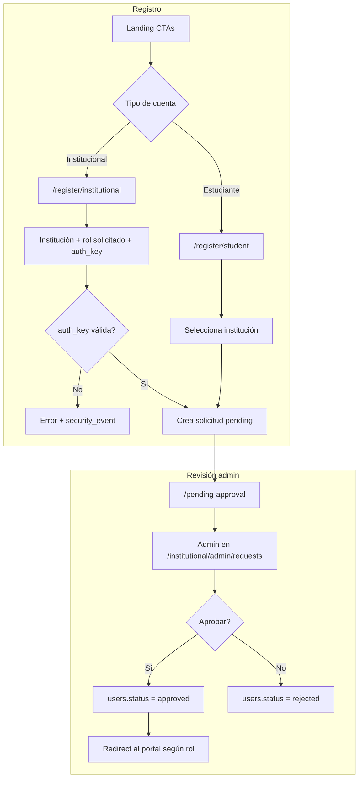

# Plan de la Plataforma Inteligente — UTB Te acompaña (Reto IA Bolívar)

> ⚠️ **Documento de planificación original (histórico).** El producto final se llama **UTB Te acompaña**. Para el estado **actual y autoritativo** (rutas, cuentas, variables de entorno, migraciones), consulta **[DOCUMENTATION.md](DOCUMENTATION.md)** y **[NEW_IDEA.md](NEW_IDEA.md)**. Algunas decisiones aquí evolucionaron: el **login es por username + contraseña** (no email), el registro exige correos **`@utb.edu.co`**, la institución es **UTB** (slug `utb`), y la orientación vocacional quedó **fusionada en la encuesta psicométrica**.

> **Plazo:** 3 semanas (21 días) · **Go-live:** Día 21  
> **Stack:** Vercel (frontend) · Render (FastAPI) · Supabase (DB/Auth/Realtime/pgvector) · OpenRouter (modelos gratuitos)  
> **Visión:** Ver [NEW_IDEA.md](NEW_IDEA.md) — plataforma institucional con portal estudiante y suite directivos.

---

## Resumen ejecutivo

| Aspecto | Decisión |
|---------|----------|
| Audiencias | Estudiantes (`/student/*`) vs roles superiores (`/institutional/*`) |
| Portal estudiante | Chat IA con historial, rutas de aprendizaje, buscador, tutor RAG, progreso |
| Suite institucional | 5 módulos + Director de IA + admin (RBAC por rol y facultad) |
| LLM fase 1 | OpenRouter con modelos `:free`; migración futura a OpenAI/Claude sin reescribir agentes |
| Seguridad | OWASP Top 10; alertas de intrusiones **solo visible para admin** |
| Multi-sesión | Sesiones concurrentes por rol, aisladas vía JWT + RLS + middleware |
| Onboarding | Registro libre (estudiante o institucional); vinculación a `institution`; **admin aprueba o deniega** |
| Roles superiores | Registro requiere `auth_key` emitida por admin (hash en DB; no autorregistro como decano/rector) |

---

## Diagnóstico: inconsistencias resueltas

### A. Entre README y plan de aprendizaje original

| Tema | README | Resolución |
|------|--------|------------|
| Alcance | 5 módulos institucionales | Dos portales: `/student/*` + `/institutional/*` (aprendizaje en portal estudiante) |
| Roles | Rector, VP, Decano, Jefe de Área, Admin, Estudiante | `student`, `area_head`, `dean`, `vice_president`, `rector`, `admin` |
| Experiencia estudiante | Chat IA + sugerencias | Portal aislado: chat persistente, rutas, buscador, tutor, progreso; **registro + aprobación admin** |
| Experiencia directivos | 5 módulos + Director de IA | Suite institucional con scope por rol; **registro con auth_key + aprobación admin** |
| Recomendaciones | Acciones institucionales | `LearningRecommenderAgent` (recursos) vs `InstitutionalActionEngine` (futuro) |
| Director de IA | KPIs ejecutivos | Tutor = estudiante; Director = datos institucionales (seed en v1) |

### B. Inconsistencias técnicas corregidas

1. **Indexación:** lazy indexing al clic (no automática en búsqueda); 20 recursos pre-seeded en demo
2. **API:** patrón BFF — Next.js proxy + SSE; FastAPI dueño de agentes y RAG
3. **Agentes:** solo `apps/api/agents/`; workers en `apps/api/workers/`
4. **Realtime vs SSE:** chat tutor vía SSE; Realtime solo alertas admin
5. **DB:** tablas completas (institutions, registration_requests, role_auth_keys, saved_resources, learning_paths, user_sessions, security_events)
6. **RLS:** políticas por rol + faculty; estudiantes bloqueados en `/institutional/*`
7. **Monorepo:** Turborepo + pnpm workspaces
8. **Onboarding:** no hay cuentas activas sin aprobación admin; usuarios `pending` solo ven `/pending-approval`

---

## Stack de despliegue

| Capa | Tecnología | Hosting | Rol |
|------|------------|---------|-----|
| Frontend | Next.js 14, TypeScript, Tailwind, shadcn/ui | **Vercel** | Landing, portales, BFF, Edge Middleware |
| Backend | Python FastAPI, LangChain | **Render** | Agentes, RAG, SSE, escritura DB |
| Base de datos | PostgreSQL + pgvector | **Supabase** | Tablas, RLS, migraciones |
| Auth | Supabase Auth (JWT) | **Supabase** | Registro, login, sesiones; estado `pending`/`approved` en `public.users` |
| Realtime | Supabase Realtime | **Supabase** | Alertas seguridad solo admin |
| Embeddings | Pre-seed + query OpenRouter / tsvector fallback | Script + API | RAG en pgvector |
| LLM | **OpenRouter** modelos `:free` | API externa | Tutor, Director, PathAgent |
| CI/CD | GitHub → Vercel + Render | Automático | Deploy en `main` |

### Proveedor LLM: OpenRouter (fase 1)

Usar [OpenRouter](https://openrouter.ai) como gateway. SDK OpenAI con `base_url` + `api_key`. Migración futura cambiando solo variables de entorno.

#### Modelos gratuitos recomendados

| Uso | ID OpenRouter | Notas |
|-----|---------------|-------|
| Tutor IA / PathAgent | `meta-llama/llama-3.2-3b-instruct:free` | Streaming SSE |
| Director de IA | `google/gemini-2.0-flash-exp:free` | Demo institucional |
| Fallback | `qwen/qwen-2-0.5b-instruct:free` | Si rate limit |

#### Embeddings sin coste (RAG fase 1)

1. **Pre-indexar:** `scripts/seed-embeddings.py` — 20 recursos demo una vez al setup
2. **Query runtime:** embedding vía OpenRouter bajo volumen **o** fallback PostgreSQL `tsvector`
3. **Lazy indexing al clic:** desactivado en fase 1
4. **Migración:** `LLM_PROVIDER=openai` en env sin reescribir agentes

#### Implementación `apps/api/core/llm.py`

```python
client = AsyncOpenAI(
    base_url=os.getenv("OPENROUTER_BASE_URL", "https://openrouter.ai/api/v1"),
    api_key=os.getenv("OPENROUTER_API_KEY"),
)
model = os.getenv("LLM_MODEL_TUTOR", "meta-llama/llama-3.2-3b-instruct:free")
```

Headers OpenRouter: `HTTP-Referer` (URL Vercel), `X-Title` (nombre app).

#### Variables LLM (Render)

| Variable | Descripción |
|----------|-------------|
| `OPENROUTER_API_KEY` | API key openrouter.ai |
| `OPENROUTER_BASE_URL` | `https://openrouter.ai/api/v1` |
| `LLM_MODEL_TUTOR` / `DIRECTOR` / `PATH` | Modelos por agente |
| `EMBEDDING_MODEL` | Routed embedding o vacío → tsvector |
| `LLM_PROVIDER` | `openrouter` (default) |

#### Migración futura (post-reto)

| Componente | Ahora | Futuro |
|------------|-------|--------|
| LLM chat | OpenRouter free | OpenAI GPT-4o / Claude directo |
| Embeddings | Seed + tsvector | OpenAI embeddings + lazy indexing |
| Infra IA | Solo APIs | Workers Render, Redis, modelos locales |

### Configuración por servicio

**Supabase**
- Extensiones: `vector`, `uuid-ossp`
- Auth: correo `@utb.edu.co` + password en registro; **login por username** (se resuelve el email internamente); redirect URLs Vercel prod + `https://*.vercel.app/**`
- Trigger `on_auth_user_created` → `public.users` con `status = 'pending'` hasta aprobación admin
- `SUPABASE_URL`, `SUPABASE_ANON_KEY` (Vercel), `SUPABASE_SERVICE_ROLE_KEY` (solo Render)

**Vercel (`apps/web`)**
- Root: `apps/web`
- `vercel.json`: CSP, HSTS
- Edge Middleware: RBAC, rate limit, redirect por rol; bloqueo portales si `status != approved`
- Env: `NEXT_PUBLIC_SUPABASE_*`, `API_URL`

**Render (`apps/api`)**

```yaml
services:
  - type: web
    name: reto-ia-bolivar-api
    runtime: python
    rootDir: apps/api
    buildCommand: pip install -r requirements.txt
    startCommand: uvicorn main:app --host 0.0.0.0 --port $PORT
    envVars:
      - key: SUPABASE_URL
        sync: false
      - key: SUPABASE_SERVICE_ROLE_KEY
        sync: false
      - key: OPENROUTER_API_KEY
        sync: false
      - key: OPENROUTER_BASE_URL
        value: https://openrouter.ai/api/v1
      - key: LLM_MODEL_TUTOR
        value: meta-llama/llama-3.2-3b-instruct:free
      - key: LLM_MODEL_DIRECTOR
        value: google/gemini-2.0-flash-exp:free
      - key: LLM_PROVIDER
        value: openrouter
      - key: ALLOWED_ORIGINS
        value: https://tu-dominio.vercel.app
```

### Variables de entorno (resumen)

| Variable | Vercel | Render | Público |
|----------|--------|--------|---------|
| `NEXT_PUBLIC_SUPABASE_URL` | sí | — | sí |
| `NEXT_PUBLIC_SUPABASE_ANON_KEY` | sí | — | sí |
| `SUPABASE_SERVICE_ROLE_KEY` | no | sí | nunca |
| `OPENROUTER_API_KEY` | no | sí | nunca |
| `OPENROUTER_BASE_URL` | no | sí | no |
| `LLM_MODEL_*` / `LLM_PROVIDER` | no | sí | no |
| `EMBEDDING_MODEL` | no | sí | no |
| `API_URL` | sí | — | no |
| `ALLOWED_ORIGINS` | — | sí | no |
| `SERPAPI_KEY` | no | sí | nunca |

### Coste estimado

- **Supabase Free:** demo/reto
- **Vercel Hobby:** previews ilimitados
- **Render Free:** cold start; **Starter** recomendado en go-live

### Consideraciones críticas de infra

| Tema | Mitigación |
|------|------------|
| SSE streaming | Proxy BFF `runtime: nodejs`; conexión larga en Render |
| Cold start Render | Starter Día 21 o ping cron en demo |
| CORS | `ALLOWED_ORIGINS` incluye `*.vercel.app` |
| Auth sync | Trigger `on_auth_user_created` → `public.users` |
| Preview Vercel | Redirect URLs en Supabase Auth |

### Checklist Día 0 (antes de codificar)

- [ ] Cuenta Supabase Cloud
- [ ] Cuenta Vercel + repo GitHub
- [ ] Cuenta Render
- [ ] `OPENROUTER_API_KEY` (modelos `:free`)
- [ ] `YOUTUBE_API_KEY` o solo SerpAPI / seed
- [ ] `SERPAPI_KEY` (opcional)
- [ ] Dominio custom (opcional, Día 21)

---

## Registro, vinculación institucional y aprobación

Nadie accede a portales (`/student/*` o `/institutional/*`) sin **vinculación a una institución** y **aprobación explícita del admin**. El registro crea cuenta en Supabase Auth, pero el perfil queda en estado `pending` hasta revisión.

### Flujo general



### Registro estudiante

| Paso | Detalle |
|------|---------|
| Ruta | `/register/student` |
| Campos | email `@utb.edu.co`, **username** único, password, nombre (institución UTB asignada automáticamente) |
| Rol asignado | `student` (solo efectivo tras aprobación) |
| Tras signup | `users.status = pending`; solicitud en `registration_requests` |
| UX | Pantalla `/pending-approval` con estado; re-login muestra mismo estado hasta decisión |
| Post-aprobación | Middleware → `/student/*` |

No requiere `auth_key`. Cualquier persona puede **solicitar** ser estudiante de una institución; el admin valida la pertenencia.

### Registro roles superiores (`area_head`, `dean`, `vice_president`, `rector`)

| Paso | Detalle |
|------|---------|
| Ruta | `/register/institutional` |
| Campos | email `@utb.edu.co`, **username** único, password, nombre, `requested_role`, **`auth_key`** (institución UTB asignada automáticamente) |
| Validación | FastAPI verifica `auth_key` contra `role_auth_keys` (hash bcrypt/argon2, no plaintext en DB) |
| Reglas clave | Clave ligada a `institution_id` + `role`; puede tener `max_uses`, `expires_at`, revocación |
| Tras signup | Igual que estudiante: `pending` + solicitud; **auth_key válida no implica auto-aprobación** |
| Post-aprobación | Middleware → `/institutional/*` según rol y scope facultad/área |

**Objetivo:** impedir que cualquiera se registre como decano/rector sin clave emitida por admin.

### Panel admin — solicitudes y claves

Rutas en `/institutional/admin`:

| Ruta | Función |
|------|---------|
| `/institutional/admin/requests` | Cola de solicitudes pending: aprobar / denegar + motivo |
| `/institutional/admin/auth-keys` | Generar, rotar y revocar `auth_key` por institución + rol |
| `/institutional/admin/users` | Usuarios aprobados; cambio de rol; suspensión |

**Aprobar solicitud (FastAPI + service_role):**

1. `users.status = 'approved'`, `users.role = requested_role`, `institution_id` confirmado
2. `registration_requests.status = 'approved'`, `reviewed_by`, `reviewed_at`
3. Si rol superior: incrementar `role_auth_keys.uses_count` de la clave usada
4. Opcional Realtime badge en admin al llegar solicitud nueva

**Denegar:** `users.status = 'rejected'`, motivo visible en `/pending-approval`; registrar `security_event` si hubo intento de clave inválida previo.

### Rol `admin`

- **No** se registra vía formulario público
- Solo seed inicial (gestor UTB `admin.demo@utb.edu.co`, username `admin_utb`) o creado por el platform admin al dar de alta la institución
- Admin seed aprueba las primeras solicitudes y emite claves para decanos/rector demo

### Middleware y RLS con estado `pending`

```typescript
// apps/web/middleware.ts — orden de comprobación
// 1. Sesión JWT válida
// 2. users.status === 'approved' (si pending/rejected → /pending-approval)
// 3. RBAC portal (student vs institutional)
// 4. Scope facultad/área en rutas institucionales
```

RLS: políticas exigen `users.status = 'approved'` en todas las tablas de datos (`chats`, `learning_paths`, KPIs, etc.). Usuarios `pending` solo pueden leer su propia fila en `users` y su `registration_requests`.

### Endpoints API (Render)

| Método | Ruta | Descripción |
|--------|------|-------------|
| `GET` | `/institutions` | Lista instituciones activas (público, sin datos sensibles) |
| `POST` | `/register/student` | Crea perfil + solicitud (tras signup Supabase en cliente) |
| `POST` | `/register/institutional` | Valida `auth_key` + crea solicitud |
| `GET` | `/admin/requests` | Cola pending (admin) |
| `POST` | `/admin/requests/{id}/approve` | Aprueba y activa rol |
| `POST` | `/admin/requests/{id}/reject` | Deniega con motivo |
| `POST` | `/admin/auth-keys` | Genera clave (retorna plaintext **una sola vez**) |
| `DELETE` | `/admin/auth-keys/{id}` | Revoca clave |

Rate limit registro: planificado 5 req/h por IP (**pendiente de implementar**). Los intentos de `auth_key` inválida sí se registran hoy como `invalid_auth_key` en `security_events`.

---

## Arquitectura por roles

### Portal estudiante (`student`)

| Área | Ruta | Funcionalidad |
|------|------|---------------|
| Chat IA | `/student/chat` | Tutor IA; historial completo; sidebar de sesiones |
| Rutas | `/student/paths` | Rutas IA personalizadas con pasos y recursos |
| Buscador | `/student/learning/search` | Búsqueda de recursos educativos |
| Tutor contextual | `/student/learning/tutor` | Chat RAG por recurso/tema |
| Progreso | `/student/progress` | Radar/barras por tema |
| Recursos guardados | `/student/resources` | Biblioteca personal |

**Chat persistente:** tablas `chats` + `messages`; SSE streaming; RLS `user_id = auth.uid()`.

### Suite institucional (roles superiores)

Roles: `area_head`, `dean`, `vice_president`, `rector`, `admin`.

| Módulo | Ruta |
|--------|------|
| Analítica | `/institutional/analytics` |
| Predicción | `/institutional/prediction` |
| Documental | `/institutional/documents` |
| Resumen ejecutivo | `/institutional/executive-summary` |
| Acciones | `/institutional/actions` |
| Director de IA | `/institutional/director` |
| Admin | `/institutional/admin` |
| Solicitudes (solo admin) | `/institutional/admin/requests` |
| Claves de rol (solo admin) | `/institutional/admin/auth-keys` |
| Seguridad (solo admin) | `/institutional/admin/security` |

| Rol | Alcance | Módulos |
|-----|---------|---------|
| `area_head` | Su área | 5 módulos + Director IA |
| `dean` | Su facultad | 5 módulos + Director IA |
| `vice_president` | Facultades asignadas | 5 módulos + Director IA |
| `rector` | Institución | 5 módulos + Director IA |
| `admin` | Institución + gestión | Todo + admin + solicitudes + auth-keys + seguridad |

**Entrega v1:** portal estudiante funcional; suite institucional scaffold + datos seed demo.

---

## Multi-sesión concurrente

- Múltiples usuarios con roles distintos activos simultáneamente
- Múltiples sesiones por usuario (dispositivos/tabs) en `user_sessions`
- Aislamiento: middleware bloquea cross-portal (`student` ≠ `/institutional`)
- Admin revoca sesiones en `/institutional/admin/security`
- Límite: 5 sesiones activas por usuario

```sql
CREATE TABLE user_sessions (
  id UUID PRIMARY KEY DEFAULT gen_random_uuid(),
  user_id UUID REFERENCES users(id) ON DELETE CASCADE,
  session_token_hash TEXT NOT NULL,
  role TEXT NOT NULL,
  ip_address INET,
  user_agent TEXT,
  device_label TEXT,
  portal TEXT CHECK (portal IN ('student', 'institutional')),
  is_active BOOLEAN DEFAULT TRUE,
  last_activity_at TIMESTAMPTZ DEFAULT NOW(),
  created_at TIMESTAMPTZ DEFAULT NOW(),
  revoked_at TIMESTAMPTZ,
  revoked_by UUID REFERENCES users(id)
);
```

---

## Ciberseguridad (alertas solo admin)

Las alertas de intrusiones son visibles **únicamente para `admin`**.

### OWASP Top 10 — mitigaciones

| Ataque | Mitigación |
|--------|------------|
| A01 Access Control | RBAC middleware + RLS + `status = approved`; auth_key para roles superiores |
| A02 Crypto | TLS, secrets en env, JWT corto + refresh |
| A03 Injection | Queries parametrizadas; Pydantic/Zod |
| A04 Insecure Design | Mínimo privilegio; `service_role` en backend |
| A05 Misconfiguration | CSP, HSTS, X-Frame-Options DENY |
| A06 Vulnerable Components | `npm audit`, `pip audit`, Dependabot |
| A07 Auth Failures | Brute-force lockout (5/15 min); auth_key con hash + expiración + max_uses |
| A08 Integrity | CSRF tokens; SameSite=Strict |
| A09 Logging | `security_events` inmutable |
| A10 SSRF | Whitelist URLs en SearchAgent/ContentAgent |

### Medidas adicionales

- Rate limit: 100 req/min general; 20 login; 30 chat IA
- DOMPurify en markdown del chat
- Prompt injection: system prompt fijo en agentes
- API keys nunca en cliente

### Tabla `security_events` (RLS: solo admin SELECT)

Tipos: `failed_login`, `brute_force`, `unauthorized_access`, `injection_attempt`, `xss_attempt`, `csrf_violation`, `rate_limit_exceeded`, `suspicious_ip`, `session_hijack_attempt`, `privilege_escalation`, `invalid_token`, `invalid_auth_key`, `registration_spam`, `anomalous_activity`.

### Panel admin seguridad

- Alertas activas (`high`/`critical`)
- Log filtrable
- Sesiones activas + revocación
- IPs bloqueadas
- Badge Realtime canal `security:admin` — **solo admin**

---

## Esquema de base de datos

### Migraciones (archivos reales en `supabase/`)

- `000_reset.sql` — elimina tablas, funciones y triggers
- `001_schema.sql` — esquema completo (`institutions`, `users`, `registration_requests`, `role_auth_keys`, `user_sessions`, `security_events`, `resources`, `resource_embeddings`, `chats`, `messages`, `learning_paths`, `saved_resources`, onboarding, etc.) + trigger `handle_new_user`
- `002_rls.sql` — RLS y políticas
- `003_seed_utb.sql` — institución UTB, facultades, recursos base
- `004_seed_platform_admin.sql` — perfil `platform_admin` (idempotente)
- `005_seed_demo_utb.sql` / `006_seed_accompaniment_utb.sql` — seeds demo opcionales

> Los bloques `CREATE TABLE` siguientes son ilustrativos del diseño; el esquema autoritativo vive en `supabase/001_schema.sql`.

### Instituciones y usuarios (`001` / `003`)

```sql
CREATE TABLE institutions (
  id UUID PRIMARY KEY DEFAULT gen_random_uuid(),
  name TEXT NOT NULL,
  slug TEXT UNIQUE NOT NULL,
  is_active BOOLEAN DEFAULT TRUE,
  created_at TIMESTAMPTZ DEFAULT NOW()
);

-- users (perfil vinculado a auth.users)
ALTER TABLE users ADD COLUMN IF NOT EXISTS institution_id UUID REFERENCES institutions(id);
ALTER TABLE users ADD COLUMN IF NOT EXISTS status TEXT
  CHECK (status IN ('pending', 'approved', 'rejected', 'suspended')) DEFAULT 'pending';
ALTER TABLE users ADD COLUMN IF NOT EXISTS faculty_id UUID;  -- scope decano / jefe área
ALTER TABLE users ADD COLUMN IF NOT EXISTS area_id UUID;     -- scope jefe de área
```

### Onboarding (`003_onboarding.sql`)

```sql
CREATE TABLE role_auth_keys (
  id UUID PRIMARY KEY DEFAULT gen_random_uuid(),
  institution_id UUID NOT NULL REFERENCES institutions(id),
  role TEXT NOT NULL CHECK (role IN ('area_head', 'dean', 'vice_president', 'rector')),
  key_hash TEXT NOT NULL,
  label TEXT,                    -- ej. "Clave decanato Ingeniería 2026"
  max_uses INT DEFAULT 1,
  uses_count INT DEFAULT 0,
  expires_at TIMESTAMPTZ,
  created_by UUID REFERENCES users(id),
  revoked_at TIMESTAMPTZ,
  created_at TIMESTAMPTZ DEFAULT NOW()
);

CREATE TABLE registration_requests (
  id UUID PRIMARY KEY DEFAULT gen_random_uuid(),
  user_id UUID NOT NULL REFERENCES users(id) ON DELETE CASCADE,
  institution_id UUID NOT NULL REFERENCES institutions(id),
  requested_role TEXT NOT NULL CHECK (requested_role IN (
    'student', 'area_head', 'dean', 'vice_president', 'rector'
  )),
  status TEXT NOT NULL CHECK (status IN ('pending', 'approved', 'rejected')) DEFAULT 'pending',
  auth_key_id UUID REFERENCES role_auth_keys(id),  -- NULL para estudiantes
  rejection_reason TEXT,
  reviewed_by UUID REFERENCES users(id),
  reviewed_at TIMESTAMPTZ,
  created_at TIMESTAMPTZ DEFAULT NOW(),
  UNIQUE (user_id)  -- una solicitud activa por usuario
);

CREATE INDEX idx_registration_requests_status ON registration_requests(status)
  WHERE status = 'pending';
CREATE INDEX idx_role_auth_keys_institution_role ON role_auth_keys(institution_id, role)
  WHERE revoked_at IS NULL;
```

**RLS onboarding:** `registration_requests` — usuario ve la suya; admin ve todas de su institución. `role_auth_keys` — solo admin SELECT/INSERT/UPDATE; nunca exponer `key_hash` al cliente excepto vía API admin al generar.

### Adiciones clave (`002`)

```sql
CREATE TABLE saved_resources (
  user_id UUID REFERENCES users(id),
  resource_id UUID REFERENCES resources(id),
  created_at TIMESTAMPTZ DEFAULT NOW(),
  PRIMARY KEY (user_id, resource_id)
);

CREATE TABLE learning_paths (
  id UUID PRIMARY KEY DEFAULT gen_random_uuid(),
  user_id UUID REFERENCES users(id),
  title TEXT NOT NULL,
  topic TEXT NOT NULL,
  status TEXT CHECK (status IN ('active', 'completed', 'paused')) DEFAULT 'active',
  created_at TIMESTAMPTZ DEFAULT NOW(),
  updated_at TIMESTAMPTZ DEFAULT NOW()
);

CREATE TABLE learning_path_steps (
  id UUID PRIMARY KEY DEFAULT gen_random_uuid(),
  path_id UUID REFERENCES learning_paths(id) ON DELETE CASCADE,
  step_order INT NOT NULL,
  title TEXT NOT NULL,
  resource_id UUID REFERENCES resources(id),
  completed BOOLEAN DEFAULT FALSE,
  UNIQUE(path_id, step_order)
);

ALTER TABLE chats ADD COLUMN IF NOT EXISTS title TEXT;
ALTER TABLE chats ADD COLUMN IF NOT EXISTS updated_at TIMESTAMPTZ DEFAULT NOW();
```

### RPC vectorial

```sql
CREATE OR REPLACE FUNCTION match_embeddings(
  query_embedding VECTOR(1536), match_count INT DEFAULT 10
)
RETURNS TABLE (id UUID, resource_id UUID, chunk_text TEXT, similarity FLOAT)
LANGUAGE sql STABLE AS $$
  SELECT id, resource_id, chunk_text,
         1 - (embedding <=> query_embedding) AS similarity
  FROM resource_embeddings
  ORDER BY embedding <=> query_embedding
  LIMIT match_count;
$$;
```

### Seed demo (`scripts/seed-utb-users.ts` + `supabase/005_seed_demo_utb.sql`)

Todos los correos demo usan el dominio `@utb.edu.co` (con `demo` antes de la `@` para excluirlos de correos transaccionales). Login por username.

| Username | Email | Rol | Portal | Status |
|----------|-------|-----|--------|--------|
| `admin_utb` | `admin.demo@utb.edu.co` | `admin` | `/institutional/admin` | `approved` |
| `rector` | `rector.demo@utb.edu.co` | `rector` | `/institutional/dashboard` | `approved` |
| `decano` | `decano.demo@utb.edu.co` | `dean` | `/institutional/dashboard` | `approved` |
| `estudiante01`…`10` | `estudianteNN.demo@utb.edu.co` | `student` | `/student/twin/summary` | `approved` |

Incluir:

- 1 institución **UTB** (slug `utb`) — ya creada por `003_seed_utb.sql`
- Recursos pre-indexados, KPIs demo, chats ejemplo
- `role_auth_keys` seed para probar registro institucional en staging (p. ej. `DEMO-DEAN-2026`)
- Solicitudes `pending` de ejemplo para el panel admin

---

## Estructura de carpetas

```
apps/web/app/
  page.tsx                    # Landing
  (auth)/
    login/page.tsx
    register/
      student/page.tsx        # Registro estudiante + institución
      institutional/page.tsx  # Registro rol superior + auth_key
    pending-approval/page.tsx # Estado solicitud pending/rejected
  student/                    # Portal estudiante (solo approved)
    layout.tsx
    chat/page.tsx
    paths/page.tsx
    paths/[id]/page.tsx
    learning/search/page.tsx
    learning/tutor/page.tsx
    progress/page.tsx
    resources/page.tsx
  institutional/              # Suite directivos
    layout.tsx
    analytics/page.tsx
    prediction/page.tsx
    documents/page.tsx
    executive-summary/page.tsx
    actions/page.tsx
    director/page.tsx
    admin/page.tsx
    admin/requests/page.tsx   # Aprobar / denegar solicitudes
    admin/auth-keys/page.tsx  # Generar claves por rol
    admin/security/page.tsx
  middleware.ts
apps/api/
  main.py
  core/llm.py                 # OpenRouter
  core/security.py
  core/security_monitor.py
  core/auth_keys.py           # Validación hash auth_key
  routes/register.py          # POST student / institutional
  routes/admin_requests.py    # Aprobar, denegar, auth-keys
  agents/path_agent.py
  agents/director_agent.py
  agents/tutor_agent.py
  agents/search_agent.py
scripts/seed-embeddings.py
supabase/migrations/
turbo.json
pnpm-workspace.yaml
render.yaml
apps/web/vercel.json
```

---

## Plan de 3 semanas

### Alcance MVP

| Feature | MVP | Diferido |
|---------|-----|----------|
| Buscador | Una API o solo seed | Multi-fuente, Khan/MIT |
| RAG | 20 recursos pre-seeded | Lazy indexing masivo |
| Rutas | PathAgent 4-6 pasos | Quizzes adaptativos |
| Tutor | top-5 + OpenRouter free | GPT-4o, re-ranking |
| Director IA | KPIs seed | ERP real |
| Institucional | UI + demo + RBAC | Modelos predictivos |
| Onboarding | Registro + auth_key + aprobación admin | Auto-aprobación, SSO institucional |
| Seguridad | OWASP base + panel admin | MFA, email alerts |

**Regla de prioridad:** si hay retraso → landing + auth + chat persistente + seguridad admin; recortar buscador externo.

### Semana 1 — Fundación (Días 1–7)

| Día | Entrega |
|-----|---------|
| 1–2 | Monorepo, Supabase migrations (001–003) + seed, render.yaml, Vercel link |
| 3–4 | Landing (8 secciones), design system, shells |
| 5 | Auth: login + registro dual, `/pending-approval`, middleware RBAC + status, CSP/HSTS |
| 6 | FastAPI Render, `/health`, BFF proxy, JWT, endpoints registro + validación auth_key |
| 7 | RLS (incl. pending), validación Zod/Pydantic, staging E2E registro → pending |

**Entregable:** Landing + registro/login + usuarios pending bloqueados + API conectada.

### Semana 2 — Portal estudiante (Días 8–14)

| Día | Entrega |
|-----|---------|
| 8 | `user_sessions`, multi-sesión |
| 9–10 | Chat persistente + SSE |
| 11 | Rutas aprendizaje (PathAgent + UI) |
| 12 | Buscador (API o seed) |
| 13 | Tutor RAG + `match_embeddings` |
| 14 | Progreso + recursos guardados; E2E |

**Entregable:** Portal estudiante funcional.

### Semana 3 — Institucional + go-live (Días 15–21)

| Día | Entrega |
|-----|---------|
| 15 | 5 módulos scaffold + Director IA demo |
| 16 | SecurityMonitor + `security_events` |
| 17 | Panel admin seguridad + Realtime |
| 18 | Admin: solicitudes (aprobar/denegar), auth-keys, usuarios/roles + revocación sesiones |
| 19 | ReportAgent + analítica demo |
| 20 | Pentest OWASP, hardening |
| 21 | **Go-live** producción + documentación |

### Diferido (post 3 semanas)

MFA admin, email critical alerts, scraping Khan/MIT, Recommender avanzado, datos institucionales reales, Supabase Storage, Render Background Workers.

---

## Definition of Done

### Semana 1

- [ ] Landing con 8 secciones en Vercel
- [ ] Registro estudiante → `pending` → `/pending-approval` (sin acceso a portales)
- [ ] Registro institucional sin auth_key válida → rechazo + evento seguridad
- [ ] Login estudiante **approved** → `/student/*`; decano **approved** → `/institutional/*`
- [ ] Usuario `pending` en `/student` o `/institutional` → redirect `/pending-approval`
- [ ] `GET /health` Render → 200
- [ ] BFF `/api/health` Vercel → Render OK

### Semana 2

- [ ] Historial de chats tras re-login
- [ ] Chat stream SSE + persistencia
- [ ] Ruta de aprendizaje generada con pasos
- [ ] Tutor cita recurso seed
- [ ] Buscador devuelve resultados

### Semana 3

- [ ] Admin aprueba solicitud estudiante → acceso portal en re-login
- [ ] Admin genera auth_key; registro decano con clave → pending → aprobación → `/institutional/*`
- [ ] Admin deniega solicitud → usuario ve motivo en `/pending-approval`
- [ ] Admin ve panel seguridad
- [ ] Brute-force / auth_key inválida → `security_event` solo admin
- [ ] 5 módulos institucionales navegables
- [ ] Director IA con KPI seed
- [ ] Lighthouse landing: Perf > 85, A11y > 90
- [ ] Checklist OWASP sin críticos abiertos

---

## Registro de riesgos

| # | Riesgo | Prob. | Impacto | Mitigación |
|---|--------|-------|---------|------------|
| R1 | Semana 2 sobrecargada | Alta | Alto | Seed + MVP acotado; OpenRouter free |
| R2 | Cold start Render en demo | Media | Medio | Starter Día 21; warmup |
| R3 | Rate limit OpenRouter free | Media | Medio | Retry + fallback model; tsvector |
| R4 | SSE timeout Vercel | Media | Alto | Route Handler nodejs; test Día 6 |
| R5 | RLS expone datos | Baja | Crítico | Test cuentas seed cada semana |
| R6 | API keys faltantes | Media | Alto | Checklist Día 0; fallback tsvector |
| R7 | Registro spam / claves filtradas | Media | Alto | Rate limit; max_uses + expiración auth_key; revocación admin |

---

## Landing unificada (`apps/web/app/page.tsx`)

### Design Read

Institutional SaaS landing, premium editorial / dark-tech, asymmetric layouts, cinematic scroll — sin templates AI-purple genéricos.

### Dials

- DESIGN_VARIANCE: 8 · MOTION_INTENSITY: 7 · VISUAL_DENSITY: 4

### Dirección visual

- **Paleta:** `#0A0A0B` fondo · `#C9A227` ámbar institucional · azul profundo secundario
- **Tipografía:** Instrument Serif / Newsreader (display) · Geist / DM Sans (UI)
- **Motion:** Framer Motion, `prefers-reduced-motion` respetado

### Secciones (8)

1. **Hero** — "El cerebro analítico de tu institución" · CTAs registro estudiantes / registro institucional + login
2. **Problema → Solución** — narrativa scroll 3 columnas
3. **Módulos** — 7 cards (portal estudiante + 5 institucionales)
4. **Dos experiencias** — split panel estudiante vs institucional
5. **KPIs preview** — carrusel demo con disclaimer
6. **Beneficios** — 4 tiles + tile seguridad OWASP
7. **CTA final** — registro dual + login existente
8. **Footer** — reto Bolívar

### Componentes landing

| Componente | Ubicación |
|------------|-----------|
| `HeroSection` | `components/landing/HeroSection.tsx` |
| `ModuleBentoGrid` | `components/landing/ModuleBentoGrid.tsx` |
| `ExperienceShowcase` | `components/landing/ExperienceShowcase.tsx` |
| `KpiCarousel` | `components/landing/KpiCarousel.tsx` |
| `ProblemSolutionNarrative` | `components/landing/ProblemSolutionNarrative.tsx` |
| `SecurityTrustSection` | `components/landing/SecurityTrustSection.tsx` |
| `SiteHeader` / `SiteFooter` | `components/layout/` |

---

## Criterios de éxito (go-live Día 21)

- Vercel + Render + Supabase en producción
- 3 semanas con DoD semanal verificada
- 4 cuentas seed **approved**; flujo registro estudiante → aprobación admin → portal < 5 min
- Registro rol superior exige auth_key; imposible acceder a `/institutional/*` sin aprobación
- Multi-sesión por rol sin cross-access
- Alertas seguridad solo admin
- Landing premium + portal estudiante funcional + suite scaffold con demo
- README con URLs prod, cuentas demo, env vars

---

## Checklist de implementación

- [ ] Configurar Supabase, Vercel, Render, `OPENROUTER_API_KEY`
- [ ] Monorepo Turborepo + pnpm
- [ ] Semana 1: scaffold, landing, auth, staging
- [ ] Semana 2: portal estudiante completo
- [ ] Semana 3: institucional scaffold, seguridad admin, go-live
- [ ] `supabase/seed.sql` con institución demo, usuarios approved, recursos RAG y auth-keys demo

---