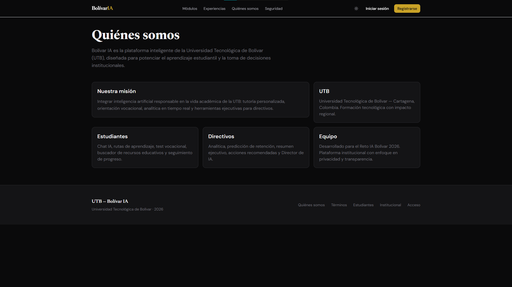
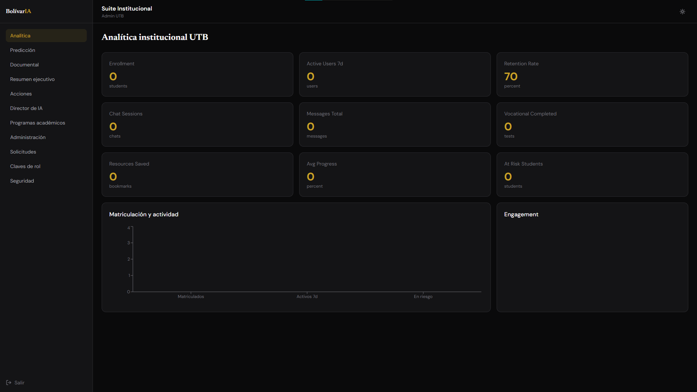

# Plataforma Inteligente — Reto IA Bolívar

Plataforma institucional con **portal estudiante** (chat IA, rutas, RAG, progreso) y **suite directivos** (5 módulos + Director de IA + admin). Incluye registro con vinculación institucional, aprobación admin y `auth_key` para roles superiores.

## Landing


## Quiénes somos


## Inicio de sesión


## Analítica institucional UTB


## Stack

| Capa | Tecnología | Hosting |
|------|------------|---------|
| Frontend | Next.js 14, TypeScript, Tailwind, Framer Motion | Vercel |
| Backend | FastAPI, OpenRouter | Render |
| DB/Auth | PostgreSQL, pgvector, Supabase Auth, RLS | Supabase |

## Estructura

```
apps/web/          → Next.js (landing, portales, BFF)
apps/api/          → FastAPI (agentes, registro, admin)
supabase/          → Migraciones SQL + seed
scripts/           → Utilidades (embeddings)
```

## Setup local

### 1. Supabase

1. Crear proyecto en [supabase.com](https://supabase.com)
2. Ejecutar migraciones en orden:
   - `supabase/migrations/001_schema.sql`
   - `supabase/migrations/002_security_sessions.sql`
   - `supabase/migrations/003_onboarding.sql`
   - `supabase/migrations/004_rls_fixes.sql`
   - `supabase/seed.sql`
3. Crear usuarios demo en Authentication (email/password):

| Email | Password | Rol (actualizar en `users`) |
|-------|----------|----------------------------|
| `estudiante@demo.uni` | `Demo2026!` | student, approved |
| `decano@demo.uni` | `Demo2026!` | dean, approved |
| `rector@demo.uni` | `Demo2026!` | rector, approved |
| `admin@demo.uni` | `Demo2026!` | admin, approved |

Tras signup, actualizar fila en `public.users`:

```sql
UPDATE users SET role = 'admin', status = 'approved',
  institution_id = 'a0000000-0000-4000-8000-000000000001'
WHERE email = 'admin@demo.uni';
```

### 2. Variables de entorno

**apps/web/.env.local**

```env
NEXT_PUBLIC_SUPABASE_URL=https://xxx.supabase.co
NEXT_PUBLIC_SUPABASE_ANON_KEY=eyJ...
NEXT_PUBLIC_APP_URL=http://localhost:3000
API_URL=http://localhost:8000
SUPABASE_SERVICE_ROLE_KEY=eyJ...
INTERNAL_REGISTER_KEY=mismo-secreto-que-en-api
RESEND_API_KEY=re_...
RESEND_FROM_EMAIL=Bolívar IA <onboarding@resend.dev>
```

**apps/api/.env**

```env
SUPABASE_URL=https://xxx.supabase.co
SUPABASE_SERVICE_ROLE_KEY=eyJ...
OPENROUTER_API_KEY=sk-or-...
ALLOWED_ORIGINS=http://localhost:3000
APP_URL=http://localhost:3000
INTERNAL_REGISTER_KEY=mismo-secreto-que-en-web
```

### Confirmación de correo (Resend)

1. Crear cuenta en [resend.com](https://resend.com) (plan gratis: 100 emails/día).
2. Copiar API key → `RESEND_API_KEY` en `apps/web/.env.local`.
3. En desarrollo usar `RESEND_FROM_EMAIL=Bolívar IA <onboarding@resend.dev>` (solo envía a tu email verificado en Resend).
4. En Supabase → **Authentication → URL Configuration** agregar:
   - Site URL: `http://localhost:3000`
   - Redirect URLs: `http://localhost:3000/auth/callback`
5. **Authentication → Providers → Email** → puedes dejar **Confirm email** activo; el registro ya **no usa** `signUp` del cliente (evita el rate limit de emails de Supabase). Solo Resend envía el correo.
6. Generar un secreto compartido y ponerlo en `INTERNAL_REGISTER_KEY` (web + api).

Flujo: registro → solicitud creada → correo Resend con enlace token → clic → sesión activa → `/pending-approval`.

### 3. Instalar y ejecutar

```bash
pnpm install
cd apps/api && pip install -r requirements.txt
pnpm dev:api    # terminal 1 — puerto 8000
pnpm dev:web    # terminal 2 — puerto 3000
```

## Flujos principales

### Registro estudiante
`/register/student` → selecciona institución → `pending` → admin aprueba en `/institutional/admin/requests` → acceso a `/student/*`

### Registro institucional
`/register/institutional` → rol + **auth_key** (generada por admin) → `pending` → aprobación → `/institutional/*`

### Clave demo (seed)
Para staging, generar claves desde el panel admin o usar el script:

```bash
python -c "import bcrypt; print(bcrypt.hashpw(b'DEMO-DEAN-2026', bcrypt.gensalt(12)).decode())"
```

Insertar hash en `role_auth_keys` con rol `dean`.

## Deploy

- **Vercel:** root `apps/web`, env vars de Supabase + `API_URL`
- **Render:** `render.yaml` incluido, root `apps/api`
- **Supabase:** redirect URLs → `https://tu-app.vercel.app/**`

## Cuentas demo

| Usuario | Contraseña | Rol | Portal |
|---------|------------|-----|--------|
| `estudiante@demo.uni` | `Demo2026!` | Estudiante | `/student/chat` |
| `decano@demo.uni` | `Demo2026!` | Decano | `/institutional/analytics` |
| `rector@demo.uni` | `Demo2026!` | Rector | `/institutional/analytics` |
| `admin@demo.uni` | `Demo2026!` | Admin | `/institutional/admin` |

## Documentación

Ver [PLAN-PLATAFORMA.md](PLAN-PLATAFORMA.md) para arquitectura completa, cronograma y Definition of Done.
