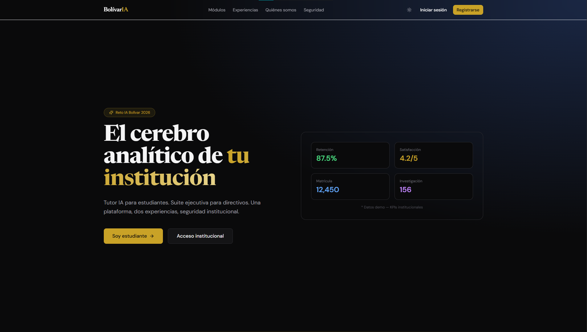
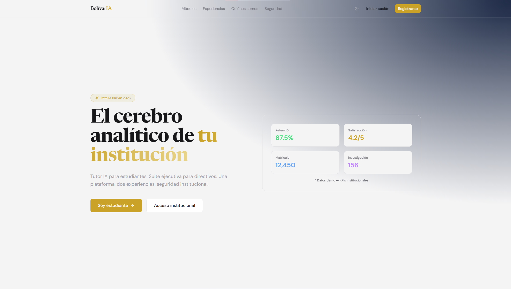
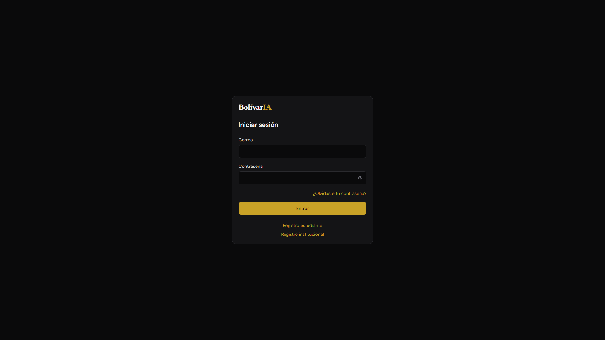

# UTB Te acompaña — Plataforma de acompañamiento estudiantil

Microservicio de la **Universidad Tecnológica de Bolívar** con portal estudiante (Digital Twin, oportunidades, recursos, aprendizaje) y suite institucional (analítica, riesgo, administración). Registro con `@utb.edu.co`, login por **usuario + contraseña**, `auth_key` para directivos.

## UTB Te acompaña





## Roles

| Rol | Acceso |
|-----|--------|
| `platform_admin` | Crear instituciones, ver todos los usuarios (`admin` / `ascendraemmanuel@gmail.com`) |
| `admin` | Gestor de una institución: solicitudes, claves, programas |
| `rector`, `dean`, etc. | Suite institucional de su universidad |
| `student` | Portal estudiante tras aprobación |



## Stack

Next.js 14 · FastAPI · Supabase (Auth + PostgreSQL + RLS) · OpenRouter · Resend

## Inicio rápido

```bash
pnpm install
# Ver DOCUMENTATION.md para variables de entorno y migraciones
pnpm dev:api   # puerto 8000
pnpm dev:web   # puerto 3000
```

## Documentación técnica

Setup local, variables de entorno, migraciones SQL, deploy y cuentas demo: **[DOCUMENTATION.md](DOCUMENTATION.md)**

Visión del producto: **[NEW_IDEA.md](NEW_IDEA.md)**

## Arquitectura

```
apps/web/     → Next.js (landing, portales, BFF)
apps/api/     → FastAPI (agentes, registro, admin)
supabase/     → SQL schema + RLS
scripts/      → Seeds y utilidades
```
